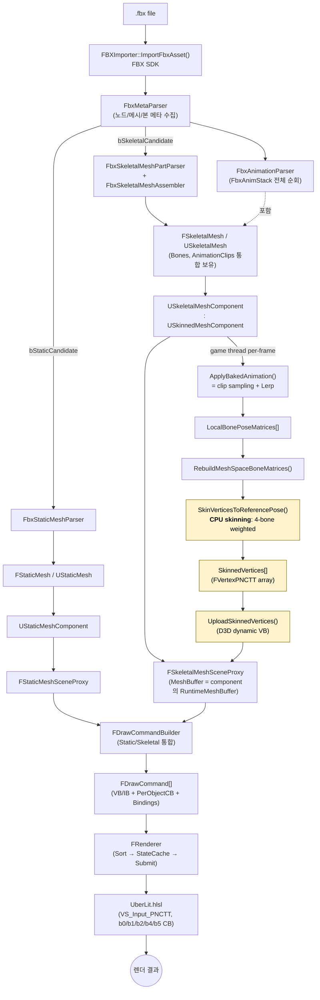
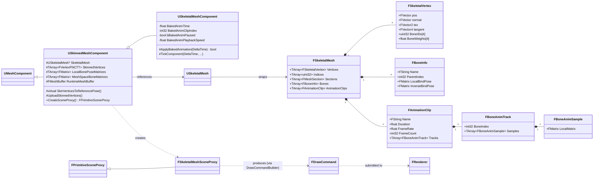
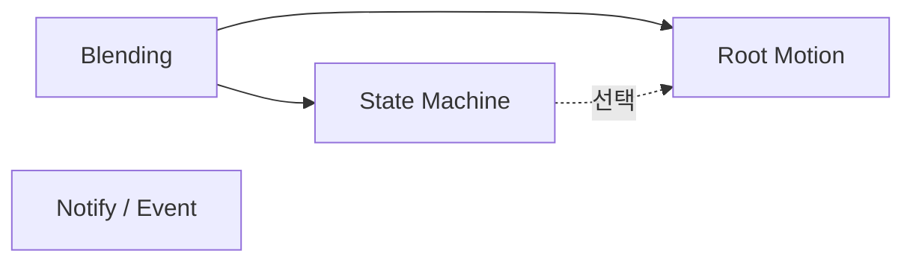

# KraftonEngine — FBX → Render Pipeline 온보딩

> 대상: 신규 팀원 (DX11 렌더 파이프라인 일반론은 알고 있으나, 이 코드베이스는 처음).
> 범위: FBX 파일이 화면에 픽셀로 찍히기까지 6단계(Importer → Asset → Component → SceneProxy → DrawCommand → Renderer)를 Static / Skeletal 두 흐름으로 추적한다. SkeletalMesh + Animation에 중심을 둔다.
> 후속 작업: ① **GPU skinning 추가** (CPU와 병행 유지), ② **Animation 기능 고도화** (Blending → State Machine → Root Motion → Notify).

---

## Section 0 — 개요

### 0.1 엔진의 큰 그림

KraftonEngine은 UObject 계열 객체 모델 위에 DX11 forward 렌더링 백엔드를 얹은 자체 엔진이다. FBX SDK를 직접 사용해 `.fbx`를 임포트하고(`FBXImporter`), 결과를 `FStaticMesh`/`FSkeletalMesh` 같은 **저수준 데이터 구조**에 저장한 뒤 `UStaticMesh`/`USkeletalMesh`로 **UObject 래핑**한다. 월드에서는 컴포넌트(`UStaticMeshComponent`, `USkeletalMeshComponent`)가 mesh asset을 참조하고, 매 프레임 자신을 위한 `FPrimitiveSceneProxy`를 노출한다. Proxy는 `FDrawCommandBuilder`를 통해 머티리얼·섹션별 `FDrawCommand`로 펼쳐지고, `FRenderer`가 정렬·서브밋한다(`Source/Engine/Render/Pipeline/Renderer.{h,cpp}`). 셰이더는 `Shaders/`에 .hlsl로 두고 `UberLit.hlsl`이 PBR 기반 메시 라이팅을 담당한다. Static과 Skeletal은 **Importer~Component까지는 별도 파일/클래스로 분리**되지만, **DrawCommand 이후로는 통합 경로** — 그 이유는 현재 Skeletal이 **CPU에서 본 스키닝을 마쳐 일반 `FVertexPNCTT` 정점 버퍼로 흘려보내기 때문**이다(자세히는 Section 5).

### 0.2 전체 흐름 (Mermaid)



> 노란색 단계가 **CPU 스키닝 경로**. GPU 스키닝을 병행 추가한다면 이 세 단계를 우회하는 **두 번째 갈래**(LocalBonePoseMatrices → bone palette 업로드 → VS에서 변환)가 SceneProxy 또는 DrawCommand 단계에서 분기로 들어가야 한다(자세히는 Section 5/6/8).

### 0.3 핵심 클래스 (Mermaid)



핵심 관찰:

- `USkeletalMeshComponent`는 **animation 재생 책임**만 가지고, **스키닝 책임은 기반 클래스 `USkinnedMeshComponent`** 가 가진다. 이 분리가 향후 GPU skinning 분기를 어디에 둘지를 결정한다.
- `Skeleton`과 `AnimationClip`이 **별도 asset 클래스로 분리되어 있지 않다**. `FSkeletalMesh` 내부에 `TArray<FBoneInfo>`, `TArray<FAnimationClip>`로 통합 저장된다(`SkeletalMeshAsset.h:86-130`).
- Animation은 **곡선이 아닌 baked matrix 샘플링** 방식이다. 각 본의 프레임마다 `LocalMatrix` 하나만 저장하며(`FBoneAnimSample`, `SkeletalMeshAsset.h:39-42`), T/R/S 채널 / tangent / interpolation 정보는 보존되지 않는다.

### 0.4 현황 요약표

가설을 코드로 검증한 결과. 본문(Section 1~6)에서 각 단계의 세부 위치를 확인한다.

| 영역 | 현재 상태 | 핵심 위치 | GPU skinning / Anim 고도화 시 손댈 곳 |
|---|---|---|---|
| FBX Importer | 완성도 높음 (Static/Skeletal/Animation 모두) | `Source/Engine/Mesh/FBX/` (13 파일) | **Anim curve 기반 재설계** 필요 시 `FbxAnimationParser` |
| 단일 vs 복수 clip | **복수 clip 지원** (가설과 다름) | `FbxAnimationParser` (FbxAnimStack 전체 순회) | — |
| Anim 채널 보존 | **Baked LocalMatrix만** (T/R/S 별도/tangent 미보존) | `SkeletalMeshAsset.h:39-42` | Blending / Root motion 도입 시 표현 변경 검토 |
| Skeleton/Clip asset 분리 | **없음** — `FSkeletalMesh`에 통합 | `SkeletalMeshAsset.h:86-130` | 여러 mesh가 skeleton 공유 / clip 재사용 시 **선행 분리** 필요 |
| SkeletalMeshComponent | 재생 + 속도 조절 + 일시정지 + clip index | `SkeletalMeshComponent.h:13-34` | Blending/State Machine은 여기 또는 별도 시스템 |
| Pose 계산 시점/스레드 | game thread, `TickComponent` per-frame | `SkeletalMeshComponent.cpp:22-98` (`ApplyBakedAnimation`) | 그대로 유지 가능 |
| Local→Mesh space 변환 | 부모/자식 계층 정확 적용 | `SkinnedMeshComponent::RebuildMeshSpaceBoneMatrices` | GPU 스키닝 분기에서도 **bone palette 만들 때 동일하게 필요** |
| **CPU skinning** | game thread, vertex별 4-bone 가중합 | **`SkinnedMeshComponent.cpp:337-393` (`SkinVerticesToReferencePose`, virtual)** | **분기 hook 1순위**: virtual override / 모드 플래그로 분기 |
| Skinned VB 업로드 | per-frame, dynamic D3D 버퍼 | `SkinnedMeshComponent::UploadSkinnedVertices` (cpp:300-307) | GPU 경로에서는 이 업로드 자체가 사라짐 (정적 VB만 사용) |
| Skeletal SceneProxy | `FPrimitiveSceneProxy` 상속, MeshBuffer 직접 참조 | `Source/Engine/Render/Proxy/SkeletalMeshSceneProxy.{h,cpp}` | bone palette를 proxy로 전달하는 새 경로 추가 (또는 Component→Renderer 직통) |
| DrawCommand 갈래 | **Static/Skeletal 통합 `FDrawCommand`** | `Source/Engine/Render/Command/DrawCommand.h` | GPU 경로용 bone palette 바인딩 슬롯 추가 또는 별도 갈래 |
| Skeletal 전용 셰이더/패스 | **없음** — `VS_Input_PNCTT` 공용 | `Shaders/Geometry/UberLit.hlsl`, `Shaders/Common/VertexLayouts.hlsli:27-34` | **GPU skinning 시 핵심 변경점**: VS Input에 bone idx/weight 추가, 신규 셰이더 분기 |
| CB 슬롯 사용 | b0 Frame / b1 PerObject / b2 PerShader1 / b4 Lighting / b5 Shadow | `Shaders/Common/ConstantBuffers.hlsli` | **b3 비어 있음** → 256개 이하 bone이면 b3에 bone palette CB 가능 |
| SRV 슬롯 사용 | t0/t1 머티리얼, t21~t23 그림자 아틀라스 | 〃 | bone palette를 structured buffer로 둘 경우 그 위 슬롯(t2 이후) 사용 |
| Render thread 동기화 | 명시적 mutex 없음 — 사실상 단일 스레드 | — | GPU 도입 시에도 이 전제 안에서 단순 |
| 고급 anim (Blend/SM/RM/Notify) | **전부 미구현** | — | Section 8 파트 2 참조 |
| **프로파일링 인프라** | CPU/GPU 매크로 모두 구비 | `Profiling/Stats.h` (`SCOPE_STAT`), `Profiling/GPUProfiler.h` (`GPU_SCOPE_STAT`, ID3D11Query disjoint) | **추가 인프라 불필요**. 두 매크로만으로 CPU vs GPU 비교 가능 |
| Editor 시각화 | Skeletal viewer 위젯 존재 (본 표시·anim 플레이백) | `Source/Editor/UI/EditorSkeletalMeshViewerWidget.{h,cpp}` | **CPU/GPU 토글 UI를 얹기 좋은 위치** |

#### GPU skinning 도입 시 hook 지점 (요약)

신규 팀원 시점에서, "어디를 건드려야 GPU 스키닝이 들어가는가"의 답은 다음 6곳이다(상세는 Section 5/6/8):

1. **셰이더 / Input Layout** — `Shaders/Common/VertexLayouts.hlsli`에 `VS_Input_PNCTT_Skinned`(또는 별도) 추가, `UberLit.hlsl` VS에서 변환 분기.
2. **bone palette buffer** — CB(b3) 또는 StructuredBuffer(t슬롯). 둘 다 슬롯 여유 있음.
3. **Component 분기** — `USkinnedMeshComponent::SkinVerticesToReferencePose`가 virtual이므로 GPU 모드일 때 **CPU 경로를 스킵**하고 bone palette 업로드 함수로 우회.
4. **MeshBuffer 처리** — GPU 모드에서는 `RuntimeMeshBuffer`(dynamic VB) 대신 **원본 `FSkeletalMesh::Vertices`의 정적 VB**(skin index/weight 포함)를 사용해야 한다.
5. **SceneProxy / DrawCommand** — `FDrawCommand::Bindings`에 bone palette 슬롯 추가 (또는 Static/Skeletal 통합 갈래에서 분기 플래그).
6. **모드 플래그** — `USkinnedMeshComponent`에 per-component bool(또는 enum) + Editor UI 토글(`EditorSkeletalMeshViewerWidget`에서 연결).

---

## Section 1 — FBX Importer

### A. 공통 로직 (Static / Skeletal 공유)

- 진입점은 `FBXImporter::ImportFbxAsset(const FString&, FFBXAsset&)` 하나(`Source/Engine/Mesh/FBX/FBXImporter.h:71-94`).
- 분기 전 공통 작업:
  1. `InitializeSdk()` → `FbxManager` 생성
  2. `LoadScene()` → `FbxImporter`로 `.fbx` 파싱
  3. `FFbxMetaParser::BuildFbxMeta(Scene)` — 노드 트리를 재귀 순회해 `FFbxNodeMeta` / `FFbxMeshMeta` / `FFbxBoneMeta` / `FFbxSkeletonMeta`를 모은다. 각 메시는 `bStaticCandidate` / `bSkeletalCandidate` 플래그로 분류된다(`FbxMetaParser.h:8-52`).
- 분기 후에는 `FFBXAsset` 컨테이너(`StaticMeshes`, `SkeletalMeshes`, `MeshIdToStaticMeshAssetIndex`, `SkeletonIdToSkeletalMeshAssetIndex` 등 — `FBXImporter.h:56-69`)에 결과가 채워진다.
- 마지막에 `BuildSceneComponents()`가 둘을 합쳐 `FFBXSceneComponentDesc` 리스트를 만들어 월드 배치에 사용한다(`FBXImporter.cpp:36-99`).

### B. SkeletalMesh + Animation 현재 상태

1) **책임**
   - Skeletal 분기: `FFbxSkeletalMeshPartParser` → 정점/스킨 가중치 추출, `FFbxSkeletalMeshAssembler` → 본 계층 + 메시 조립.
   - Animation: `FFbxAnimationParser`가 Scene의 `FbxAnimStack`을 전부 순회해 본별 트랙을 **프레임 단위 LocalMatrix로 베이크**.

2) **핵심 클래스 / 파일**
   - `FFbxSkeletalMeshPartParser` — `Source/Engine/Mesh/FBX/FbxSkeletalMeshPartParser.{h,cpp}`
   - `FFbxSkeletalMeshAssembler` — `Source/Engine/Mesh/FBX/FbxSkeletalMeshAssembler.{h,cpp}`
   - `FFbxAnimationParser` — `Source/Engine/Mesh/FBX/FbxAnimationParser.{h,cpp}`
   - BindPose 출처: `FFbxBoneMeta::BindGlobalMatrix`, `InvBindGlobalMatrix` (`FBXImportMeta.h:85-103`)

3) **입력 → 출력**
   - 입력: `FbxScene*` + `FFbxImportMeta` (메타 파서 산출물)
   - 출력 (Skeletal): `FSkeletalMesh` — Vertices(`FSkeletalVertex` with `BoneIDs[4]`/`BoneWeights[4]`), Indices, Sections, Bones(`FBoneInfo`), AnimationClips(`FAnimationClip`) (`SkeletalMeshAsset.h:11-130`)
   - 가중치 정규화: `NormalizeTop4Influences()`가 vertex별 최대 4 influence로 잘라 정규화(`FbxSkeletalMeshPartParser.cpp:37-76`).

4) **다음 단계 연결**
   - `FBXImporter::ImportFbxAsset`이 위 산출물을 `FFBXAsset`에 담아 반환 (`FBXImporter.cpp:102-203`).
   - Asset 매니저 / 시리얼라이저가 `FSkeletalMesh::Serialize`로 바이너리(`.fbxscene.bin`)에 저장하고, 런타임에서 다시 읽어 `USkeletalMesh`로 래핑한다.

5) **현재 animation 처리 현황 (가설 vs 코드)**

   ⚠ **가설 불일치**: 단일 clip이라는 가설은 **틀렸다**. 실제로는 Scene의 모든 `FbxAnimStack`을 반복하며 각 stack을 하나의 `FAnimationClip`으로 저장한다:

   ```cpp
   // FbxAnimationParser.cpp:56-74
   const int32 TotalSrcObjectCount = Scene->GetSrcObjectCount();
   for (int32 ObjIndex = 0; ObjIndex < TotalSrcObjectCount; ++ObjIndex)
   {
       FbxObject* Obj = Scene->GetSrcObject(ObjIndex);
       const char* ClassName = Obj ? Obj->GetClassId().GetName() : nullptr;
       if (!ClassName) continue;
       if (std::strcmp(ClassName, "AnimStack") != 0 &&
           std::strcmp(ClassName, "FbxAnimStack") != 0) continue;
       FbxAnimStack* AnimStack = static_cast<FbxAnimStack*>(Obj);
       Scene->SetCurrentAnimationStack(AnimStack);
       // ... TimeSpan 결정 후 프레임 샘플링 (라인 90~155)
   }
   ```

   ⚠ **샘플링 방식은 "baked LocalMatrix"** — FBX curve/tangent를 보존하지 않는다. 각 프레임마다 본의 글로벌 트랜스폼을 평가한 뒤 부모 기준 로컬로 환산해 `FBoneAnimSample::LocalMatrix`에 그대로 적는다:

   ```cpp
   // FbxAnimationParser.cpp:134-153
   BoneGlobals[BoneIndex] = FBXUtil::ConvertFbxMatrix(Node->EvaluateGlobalTransform(SampleTime));
   // ...
   const int32 ParentIndex = OutMesh.Bones[BoneIndex].ParentIndex;
   FMatrix LocalMatrix = (ParentIndex >= 0 && ParentIndex < BoneCount)
       ? BoneGlobals[BoneIndex] * BoneGlobals[ParentIndex].GetInverse()
       : BoneGlobals[BoneIndex];
   Clip.Tracks[BoneIndex].Samples[FrameIndex].LocalMatrix = LocalMatrix;
   ```

   `SampleRate`는 기본 30fps이며 호출부에서 그대로 사용된다(`FBXImporter.cpp:174`). T/R/S 분리 / 곡선 interpolation 정보는 **없다**.

   | 항목 | 상태 |
   |---|---|
   | Skeleton 계층 import | 구현됨 |
   | BindPose / InvBindMatrix | 구현됨 |
   | Skin weight (Top-4) | 구현됨 |
   | **단일 clip 로딩** | **복수 지원** (가설 불일치) |
   | 복수 clip 로딩 | 구현됨 |
   | T/R/S 채널 분리 보존 | 미구현 (LocalMatrix 통합) |
   | Tangent / interpolation 정보 | 미구현 |

### C. 고도화 시 손댈 곳

#### C-1. GPU Skinning 추가 (CPU 병행)

이 단계는 GPU skinning을 위해 **데이터가 추가로 필요한 것은 없다**. `FSkeletalVertex`에 이미 `BoneIDs[4]`/`BoneWeights[4]`가 포함되어 있으므로(`SkeletalMeshAsset.h:11-19`), Importer 측은 그대로 두고 하류 단계가 이 필드를 사용하게 만들면 된다.

- 단, GPU 경로에서 원본 `Vertices`를 그대로 VB로 만들려면 **`FSkeletalMesh::Serialize`로 저장되는 정점 stride/포맷이 그대로 GPU에 올라갈 수 있는지** 확인 필요. 현재는 `FSkeletalVertex`(pos+normal+tex+tangent+ids[4]+weights[4]) 기준이며, 셰이더 Input Layout만 맞추면 그대로 사용 가능(자세히는 Section 6).

비교 메트릭 기여:
- 이 단계 자체는 빌드 시간(임포트)만 영향. 런타임 CPU vs GPU 비교에서는 직접 비교 지표가 거의 없음.

#### C-2. Animation 기능 고도화

- **Blending / State Machine**: 이 단계에서 직접 데이터 변경 없음. 단, **State machine이 같은 skeleton 위에서 여러 clip을 블렌딩하려면** 현재처럼 `FAnimationClip`이 `FSkeletalMesh` 안에 박혀 있는 구조가 제약이 된다 → **Skeleton/Clip을 별도 asset으로 분리하는 작업이 이 단계의 선행 과제**가 될 수 있다(trade-off: 분리에 따른 마이그레이션 비용 vs 재사용성).
- **Root Motion**: Importer가 root bone(보통 hierarchy 최상위)을 식별해 별도 트랙으로 빼는 옵션이 필요. 현재는 모든 본을 동등하게 baked LocalMatrix로 저장하므로 root track만 따로 추출하는 후처리가 필요하다. 임포트 시점에 분리할지(데이터 형태 변경) vs 런타임 Component에서 분리할지가 결정점.
- **Notify / Event**: FBX 표준에 직접 매핑은 없음. **별도 데이터 채널(예: 클립 메타 사이드카 JSON, 또는 `FAnimationClip`에 `TArray<FNotifyEntry>` 추가)** 도입 필요. 이 단계 영향은 데이터 구조 추가만.
- (모두 공통) **곡선 기반 sampling으로 전환할 의향이 있다면** `FbxAnimationParser`를 baked 방식에서 curve evaluator 방식으로 재설계해야 한다. trade-off: 메모리 ↓ + 보간 품질 ↑ vs 런타임 evaluation 비용 ↑.

---

## Section 2 — Asset

### A. 공통 로직

- 저수준 구조체(`FStaticMesh`, `FSkeletalMesh`)는 POD에 가깝게 설계되어 있고, 각자 `Serialize(FArchive&)`를 가진다.
- 고수준 래퍼는 UObject 계열(`UStaticMesh`, `USkeletalMesh`)이며 머티리얼 슬롯과 자산 경로를 추가로 보유한다.
- `FFBXAsset`은 임포트 1회분의 컨테이너로, Static과 Skeletal mesh를 함께 들고 있고 `MeshId↔Index` 맵으로 원본 FBX 식별자 ↔ 로컬 인덱스를 연결한다(`FBXImporter.h:56-69`).

### B. SkeletalMesh + Animation 현재 상태

1) **책임**: `.fbx`에서 추출된 정점·인덱스·본·애니메이션 클립을 **하나의 `FSkeletalMesh` 구조체로 통합 저장**. UObject 래퍼는 머티리얼 인터페이스를 붙여준다.

2) **핵심 클래스 / 파일**
   - 저수준: `FSkeletalMesh` — `Source/Engine/Mesh/SkeletalMeshAsset.h:86-130`
   - 고수준: `USkeletalMesh` — `Source/Engine/Mesh/SkeletalMesh.{h,cpp}`
   - 부속: `FSkeletalVertex`, `FBoneInfo`, `FBoneAnimSample`, `FBoneAnimTrack`, `FAnimationClip` — 모두 `SkeletalMeshAsset.h`에 정의

3) **입력 → 출력**
   - 입력: `FBXImporter` 산출물 (`FFBXAsset::SkeletalMeshes`)
   - 출력: 디스크에 바이너리(`FArchive` 기반) 저장, 런타임에 `FMeshManager::LoadSkeletalMesh(path)` (`Source/Engine/Mesh/MeshManager.{h,cpp}`)가 다시 `USkeletalMesh*`로 복원

4) **다음 단계 연결**
   - Component가 `USkinnedMeshComponent::SetSkeletalMesh(USkeletalMesh*)`로 참조(`SkinnedMeshComponent.cpp:20-44`)하며, 본/머티리얼 슬롯/바운드를 초기화한다.

5) **현재 animation 처리 현황 (가설 vs 코드)**

   ⚠ **Skeleton/AnimationClip이 독립 asset이 아니다** — 둘 다 `FSkeletalMesh` 안에 `TArray<FBoneInfo> Bones`, `TArray<FAnimationClip> AnimationClips`로 통합 저장됨:

   ```cpp
   // SkeletalMeshAsset.h:86-93
   struct FSkeletalMesh
   {
       FString PathFileName;
       TArray<FSkeletalVertex> Vertices;
       TArray<uint32> Indices;
       TArray<FMeshSection> Sections;
       TArray<FBoneInfo> Bones;
       TArray<FAnimationClip> AnimationClips;
       // ...
   };
   ```

   - 한 mesh가 자기 스켈레톤과 자기 클립을 통째로 들고 다닌다. **여러 mesh가 같은 skeleton을 공유하거나, 같은 clip을 다른 mesh에 적용하려면 데이터 중복 / 정합성 문제가 발생**한다.

### C. 고도화 시 손댈 곳

#### C-1. GPU Skinning 추가 (CPU 병행)

- `FSkeletalMesh` 자체는 변경 불필요(이미 본/가중치를 보유). 다만 **per-component skinning 모드 플래그**(예: `ESkinningMode { CPU, GPU }`)를 `USkinnedMeshComponent`에 추가하기로 하면, asset 측에 "GPU 호환 vertex 포맷이 준비된 mesh인가" 등의 메타 필드를 둘지 결정해야 함.
- Trade-off: per-component 플래그가 가장 유연 / asset-level 플래그는 일관된 운용에 유리. 본 문서 결정: **Per-component 플래그 + Editor UI 토글**(Section 8).

비교 메트릭 기여:
- **메모리**: CPU 경로의 `SkinnedVertices`(`FVertexPNCTT` array, per-component)와 GPU 경로의 bone palette(per-component CB/SB) 크기 비교 가능. asset 자체 메모리는 둘 다 동일하게 들 것.

#### C-2. Animation 기능 고도화

- **Blending / State Machine 도입의 핵심 선행 과제**: `FAnimationClip`을 `FSkeletalMesh`에서 떼어내 **`FAnimationClipAsset` (독립 UObject)** 로 분리. 그리고 `FBoneInfo` 묶음을 **`FSkeletonAsset`** 로 추출. 그러면:
  - 여러 mesh가 같은 skeleton을 공유 (rig-share)
  - State Machine이 클립 슬롯을 가지고 외부 asset을 가리키게 됨
  - Trade-off: 기존 직렬화 포맷 비호환 → 마이그레이션 도구 필요. 첫 출시 전이라면 지금이 비용 최저.
- **Root Motion**: `FAnimationClip`에 root track index 메타데이터를 추가하거나, 별도 `FRootMotionTrack` 필드 도입. asset 변경 필요.
- **Notify**: `FAnimationClip`에 `TArray<FAnimNotify>`(시간 + 이벤트 이름 + 페이로드) 추가. 직렬화 확장.

---

## Section 3 — Component

> 이 단계가 **runtime animation 평가 + CPU skinning의 본진**이다.

### A. 공통 로직

- 모든 mesh component는 `UMeshComponent` → `UPrimitiveComponent` 계열을 상속한다.
- 공통: `CreateSceneProxy()` (proxy 인스턴스화), `MarkRenderStateDirty()`, `MarkWorldBoundsDirty()`, 머티리얼 슬롯 관리.
- Tick 자체는 `UPrimitiveComponent::TickComponent` 부모 체인에서 호출되며, 컴포넌트 종류마다 override.

### B. SkeletalMesh + Animation 현재 상태

1) **책임 (2계층으로 분리)**
   - `USkinnedMeshComponent` (`SkinnedMeshComponent.{h,cpp}`) — **skinning과 mesh buffer 관리** 전담. Animation 재생은 하지 않는다. `SetSkeletalMesh`, `SetBoneLocalPose`, `RebuildMeshSpaceBoneMatrices`, `SkinVerticesToReferencePose`, `UploadSkinnedVertices`, `CreateSceneProxy(→ FSkeletalMeshSceneProxy)` 보유.
   - `USkeletalMeshComponent : public USkinnedMeshComponent` (`SkeletalMeshComponent.{h,cpp}`) — **animation 재생만** 추가. 멤버는 4개: `BakedAnimTime`, `BakedAnimClipIndex`, `bBakedAnimPaused`, `BakedAnimPlaybackSpeed` (`SkeletalMeshComponent.h:13-34`).

2) **핵심 클래스 / 파일**
   - `USkinnedMeshComponent` — `Source/Engine/Component/SkinnedMeshComponent.{h,cpp}`
   - `USkeletalMeshComponent` — `Source/Engine/Component/SkeletalMeshComponent.{h,cpp}`
   - 멤버 컨테이너:
     - `TArray<FVertexPNCTT> SkinnedVertices` — **CPU skinning 결과 버퍼** (`SkinnedMeshComponent.h:49`)
     - `TArray<FMatrix> LocalBonePoseMatrices` — pose evaluation 결과 (local space)
     - `TArray<FMatrix> MeshSpaceBoneMatrices` — local→mesh space 변환 결과
     - `FMeshBuffer RuntimeMeshBuffer` — D3D dynamic VB/IB

3) **입력 → 출력**
   - 입력: `USkeletalMesh*`(asset), `DeltaTime`(tick)
   - 출력: per-frame 갱신된 `RuntimeMeshBuffer`(GPU 동적 VB)

4) **다음 단계 연결**
   - `USkinnedMeshComponent::CreateSceneProxy()` (cpp:14-18)가 `new FSkeletalMeshSceneProxy(this)`를 만들어 `FScene`에 등록.
   - 매 프레임 `ApplyBakedAnimation`(있는 clip이 있다면) → `RebuildMeshSpaceBoneMatrices` → `SkinVerticesToReferencePose` → `EnsureRuntimeResources`(→ `UploadSkinnedVertices`) 순(`SkeletalMeshComponent.cpp:22-98`).
   - Proxy는 `UpdateMesh()`에서 `MeshBuffer = GetOwner()->GetMeshBuffer()`로 component의 동적 버퍼를 그대로 참조한다(`SkeletalMeshSceneProxy.cpp:39-43`).
   - **스레드 경계**: 전 과정이 **game thread**. 별도 render thread 큐/락은 없다.

5) **현재 animation 처리 현황 (CPU skinning 위치 — 자세히)**

   가설(재생+속도조절만)은 **그대로 확인됨**. 재생 로직은 `ApplyBakedAnimation`이 전부:

   ```cpp
   // SkeletalMeshComponent.cpp:43-91 (발췌)
   if (!bBakedAnimPaused)
       BakedAnimTime += DeltaTime * BakedAnimPlaybackSpeed;
   float LoopedTime = std::fmod(BakedAnimTime, Clip.Duration);
   const float Alpha = LoopedTime / Clip.Duration;
   const float FrameFloat = Alpha * (Clip.FrameCount - 1);
   int32 FrameA = std::floor(FrameFloat), FrameB = FrameA + 1;
   const float Blend = FrameFloat - FrameA;
   for (int32 BoneIndex = 0; BoneIndex < Bones.size(); ++BoneIndex) {
       const FMatrix& A = Clip.Tracks[BoneIndex].Samples[FrameA].LocalMatrix;
       const FMatrix& B = Clip.Tracks[BoneIndex].Samples[FrameB].LocalMatrix;
       // element-wise lerp — 30fps에서 affine drift 무시
       LocalBonePoseMatrices[BoneIndex] = ElementwiseLerp(A, B, Blend);
   }
   ```

   → 보간은 **행렬 원소별 lerp**로 단순 처리. 회전을 quaternion으로 분리하지 않으므로 큰 회전이 들어간 키 사이에서는 시각적 왜곡이 가능(현재 30fps에서 무시 가능하다고 코드 주석이 명시 — `SkeletalMeshComponent.cpp:81`).

   **CPU skinning 위치 (매우 중요)** — `USkinnedMeshComponent::SkinVerticesToReferencePose` (`SkinnedMeshComponent.cpp:337-393`). 반드시 **game thread**의 `ApplyBakedAnimation` 내부에서 호출된다:

   ```cpp
   // SkinnedMeshComponent.cpp:361-374 (skinning 내부 루프)
   for (int32 Influence = 0; Influence < 4; ++Influence)
   {
       const float Weight = Source.BoneWeights[Influence];
       const uint32 BoneIndex = Source.BoneIDs[Influence];
       if (Weight <= 0.0f || BoneIndex >= MeshSpaceBoneMatrices.size()) continue;

       const FMatrix SkinMatrix =
           Asset->Bones[BoneIndex].InverseBindPose * MeshSpaceBoneMatrices[BoneIndex];
       SkinnedPos    += SkinMatrix.TransformPositionWithW(Source.pos)   * Weight;
       SkinnedNormal += SkinMatrix.TransformVector(Source.normal)       * Weight;
       TotalWeight   += Weight;
   }
   ```

   - 결과는 `SkinnedVertices[VertexIndex]` (= `TArray<FVertexPNCTT>`, component 멤버)에 기록.
   - **함수 자체가 `virtual`** (`SkinnedMeshComponent.h:44`) — GPU 경로 분기의 가장 자연스러운 hook.
   - 직후 `EnsureRuntimeResources()`가 `UploadSkinnedVertices()`를 호출, `RuntimeMeshBuffer.UpdateVertices(Context, SkinnedVertices)`로 dynamic VB를 갱신 (`SkinnedMeshComponent.cpp:252-307`).
   - 갱신 빈도: **매 프레임**(애니메이션이 돌아가는 한). 정지 상태(`bBakedAnimPaused`)에서도 `ApplyBakedAnimation`은 매 tick 호출되지만, `BakedAnimTime`이 멈춰 vertex 결과가 동일해 동일 데이터로 덮어 씀.

   | 항목 | 상태 |
   |---|---|
   | 현재 clip / 시간 / 속도 / 일시정지 | 구현됨 (4개 멤버) |
   | Pose 평가 (frame Lerp, element-wise) | 구현됨 |
   | Local → Mesh space 누적 변환 | 구현됨 |
   | **CPU skinning (4-bone)** | **구현됨 — game thread** |
   | Blending / State machine / Root motion / Notify | 미구현 |

### C. 고도화 시 손댈 곳

#### C-1. GPU Skinning 추가 (CPU 병행)

이 단계가 GPU vs CPU **분기의 1차 hook**.

데이터 구조 (선택지):
- (a) `USkinnedMeshComponent::SkinVerticesToReferencePose`를 GPU 모드에서 **no-op 처리**하고, 대신 `MeshSpaceBoneMatrices` → bone palette 데이터(또는 `InverseBindPose × MeshSpaceBoneMatrix` 미리 합쳐둔 SkinMatrix array)를 SceneProxy로 넘김.
- (b) GPU 모드에서는 `RuntimeMeshBuffer`(dynamic VB)를 만들지 않고, asset의 **원본 `FSkeletalMesh::Vertices`로 만든 정적 VB**를 직접 사용. → `GetMeshBuffer()`를 모드에 따라 분기.

분기 지점 후보:
- (1) `ESkinningMode { CPU, GPU }` enum + `USkinnedMeshComponent` 멤버, Setter는 Editor UI에서 호출. **본 문서 1순위(Section 8)**.
- (2) `USkinnedMeshComponent::SkinVerticesToReferencePose` 가상 함수를 **`UGpuSkinnedMeshComponent : USkinnedMeshComponent`** 서브클래스에서 override해 no-op. (런타임 토글 불가)
- (3) cvar(전역). 같은 씬에서 CPU/GPU 비교가 어려워 비추천.

CPU 코드와의 격리:
- (1)/(2) 모두 기존 CPU 경로를 그대로 둔다. **"CPU 제거"가 아니라 분기 추가**. 두 경로 모두 살려야 비교 setup이 성립.

비교 메트릭 기여:
- **CPU 시간**: `SkinVerticesToReferencePose` 함수 본체에 `SCOPE_STAT("Skin.CPU")` 한 줄 추가 → 같은 함수에서 GPU 모드면 no-op, CPU 모드면 측정값을 얻음.
- **버퍼 업로드 시간**: `UploadSkinnedVertices`를 `SCOPE_STAT("Skin.Upload")`로 감싸면 dynamic VB 업로드 비용 분리 측정.
- **메모리**: CPU 경로에서 component당 `sizeof(FVertexPNCTT) × VertexCount`만큼 추가 메모리. GPU 경로에서는 `sizeof(FMatrix) × BoneCount`(보통 ≤256).

DX11 제약 (이 단계에 직접):
- 동적 VB의 `Map(WRITE_DISCARD)`가 CPU→GPU 대역폭의 주범. vertex 많을수록 GPU 경로가 유리.

#### C-2. Animation 기능 고도화

- **Blending**: `USkeletalMeshComponent`가 단일 `BakedAnimClipIndex` 대신 **두 clip + alpha**, 또는 **AnimGraph 노드 트리**를 들고 매 tick local pose를 합성하도록 확장. `LocalBonePoseMatrices` 산출까지가 새 책임이며, 이후 `RebuildMeshSpaceBoneMatrices`/`SkinVerticesToReferencePose`는 그대로 사용 가능 — **고도화가 skinning 단계에 영향을 거의 주지 않는다**.
  - 설계 결정점: pose 표현을 (a) `FMatrix` 원소 lerp 유지 vs (b) `FQuat` + `FVector` 분리 (skinning 직전 합성). 회전 보간 품질 차이.
- **State Machine**: `USkeletalMeshComponent`에 anim controller 객체 추가 또는 별도 `UAnimInstance` 도입. 데이터 driven(JSON/스크립트)이냐 code driven이냐가 결정점. Tick 안에서 graph 평가 → blended local pose → skinning 흐름.
- **Root Motion**: `LocalBonePoseMatrices[RootBoneIndex]`의 translation 성분을 매 프레임 차분해 **component world transform**으로 빼고, pose에서는 제거(또는 0 처리). 이 단계가 주 작업 위치. 물리/충돌과 결합 시 컨트롤러 또는 별도 movement component와 협업 필요.
- **Notify / Event**: `ApplyBakedAnimation`에서 `BakedAnimTime` 진행 중 클립 메타의 notify 시각을 가로지를 때 이벤트를 발화. 발화 위치는 **game thread**, 콜백 호출. 스레드 안전성 부담 적음.

---

## Section 4 — SceneProxy

### A. 공통 로직

- `FPrimitiveSceneProxy`가 모든 primitive proxy의 기반 클래스(`Render/Proxy/PrimitiveSceneProxy.h:42-145`).
- Component가 `CreateSceneProxy()`로 한 번 만들고, 이후 `DirtyFlags`가 켜질 때 `UpdateTransform/UpdateMaterial/UpdateMesh/UpdateVisibility/UpdatePerViewport` 가상 함수들로 부분 갱신한다(헤더 라인 86-91).
- `MeshBuffer`(FMeshBuffer*), `SectionDraws`(`TArray<FMeshSectionDraw>`), `PerObjectConstants`, `CachedBounds`, `CachedWorldPos`를 보유 (라인 107-116).
- Renderer는 proxy를 **직접 순회**한다고 명시(라인 41 주석: "Renderer가 매 프레임 이 프록시를 직접 순회하여 draw call 수행").

### B. SkeletalMesh + Animation 현재 상태

1) **책임**: Component의 dynamic `RuntimeMeshBuffer`를 그대로 가리키고, 머티리얼 슬롯/섹션을 머티리얼 포인터로 정렬해 `SectionDraws`를 만든다.

2) **핵심 클래스 / 파일**
   - `FSkeletalMeshSceneProxy` — `Source/Engine/Render/Proxy/SkeletalMeshSceneProxy.{h,cpp}` (전체 19+106줄, 매우 짧음)
   - `FStaticMeshSceneProxy` — `Source/Engine/Render/Proxy/StaticMeshSceneProxy.{h,cpp}` (LOD 8단계 지원)

3) **입력 → 출력**
   - 입력: `USkinnedMeshComponent*` (생성자), `FFrameContext` (per-viewport 갱신)
   - 출력: `MeshBuffer`(공유 참조), `SectionDraws`(material-sorted)

4) **다음 단계 연결**
   - `FDrawCommandBuilder::BuildCommandForProxy(Proxy, Pass)`(`DrawCommandBuilder.cpp:123-195`)가 proxy의 `MeshBuffer`/`SectionDraws`/`PerObjectConstants`를 읽어 `FDrawCommand` 시퀀스로 변환.

5) **현재 animation 처리 현황**
   - Proxy는 animation을 인지하지 않는다. **이미 CPU skinning 결과가 들어있는 dynamic VB**(component의 `RuntimeMeshBuffer`)를 그냥 가리킬 뿐:

   ```cpp
   // SkeletalMeshSceneProxy.cpp:39-43
   void FSkeletalMeshSceneProxy::UpdateMesh()
   {
       MeshBuffer = GetOwner()->GetMeshBuffer();
       RebuildSectionDraws();
   }
   ```

   - **Pose → render thread 동기화 메커니즘 없음**. Component·Proxy·Renderer가 모두 game thread에서 순차 실행되며, dynamic VB 업로드(`D3D11_MAP_WRITE_DISCARD`)는 D3D 드라이버 측 fence에 위임.

### C. 고도화 시 손댈 곳

#### C-1. GPU Skinning 추가 (CPU 병행)

GPU 경로에서는 proxy가 **bone palette를 함께 들고 다녀야** 한다. 선택지:

- (a) Proxy 멤버에 `TArray<FMatrix> SkinMatrices`를 추가하고, `UpdatePerViewport`(또는 새 가상 함수)에서 Component로부터 복사. → Proxy 메모리 ↑, 갱신 비용 분산.
- (b) Proxy는 그대로 두고, **Component가 직접** bone palette CB를 매 프레임 채워두면 DrawCommandBuilder가 `FDrawCommandBindings`에 그 CB 포인터만 꽂는다. → Proxy 단순 유지.

본 문서 권장: **(b)**. 이미 `FDrawCommand::Bindings`가 머티리얼용 CB/SRV 포인터 컨테이너 역할이므로(`DrawCommand.h:40-44`), Component에 새 `FConstantBuffer` 멤버를 추가하고 거기로 bone palette를 흘려보내는 것이 코드 변경 폭이 가장 작다.

CPU 코드와의 격리:
- Proxy `MeshBuffer` 참조는 모드에 따라 (CPU 모드) component의 `RuntimeMeshBuffer` vs (GPU 모드) asset 정적 VB로 분기되어야 한다. 분기 자체는 Component의 `GetMeshBuffer()`에서 처리 가능.

비교 메트릭 기여:
- **draw call 수**: 동일하다(둘 다 섹션당 1 draw). 이 단계는 비교 지표에 직접 기여하지 않음.
- (참고) 다중 component가 같은 mesh를 쓸 때, GPU 경로에서 정적 VB를 공유할 수 있는지가 메모리 절약 포인트.

#### C-2. Animation 기능 고도화

- 이 단계는 4가지 기능에서 **본질적 변경이 거의 없다**. Blending/SM/Root motion은 Component 단계가 final local pose를 만들고 동일하게 skinning을 거쳐 같은 dynamic VB로 들어오기 때문.
- 예외: **GPU skinning이 먼저 들어가 있다면** blending된 final pose가 Component → Proxy → DrawCommand의 동일 bone palette 경로를 거쳐가므로 데이터 흐름이 통일된다(Section 8 파트2 참고).
- Notify: proxy와 무관.

---

## Section 5 — DrawCommand

> CPU skinning **결과를 받아 GPU로 흘려보내는 마지막 CPU 측 지점**.

### A. 공통 로직

- `FDrawCommand`(`DrawCommand.h:51-107`)는 한 draw call에 필요한 모든 것을 캡슐화: `Pass`, `Shader`, `RenderState`(Depth/Blend/Rasterizer/Topology), `Buffer`(VB+IB+범위), `PerObjectCB`(b1), `Bindings`(per-shader CB + SRV들), `SortKey`.
- **PerShaderCB 슬롯 매핑**: `FDrawCommandBindings::PerShaderCB[2]` — 주석으로 `[0]=b2, [1]=b3` 명시(`DrawCommand.h:42`).
- SortKey 비트 레이아웃: `Pass(4) | ShaderHash(16) | MeshHash(16) | SRVHash(16) | UserBits(12)` (`DrawCommand.h:88-106`).
- `FDrawCommandBuilder`가 proxy 1개를 받아 section당 `FDrawCommand` 1개씩 생산(`DrawCommandBuilder.cpp:123-195`). Static/Skeletal 양쪽 모두 이 동일 경로를 탄다.

### B. SkeletalMesh + Animation 현재 상태

1) **책임**: Skeletal proxy의 dynamic VB를 일반 정적 VB와 동일하게 취급해 통합 `FDrawCommand`로 변환. Skeletal 전용 `FDrawCommand` 갈래는 **없다**.

2) **핵심 클래스 / 파일**
   - `FDrawCommand`, `FDrawCommandBuffer`, `FDrawCommandBindings`, `FDrawCommandRenderState` — `Source/Engine/Render/Command/DrawCommand.h`
   - `FDrawCommandBuilder` — `Source/Engine/Render/Command/DrawCommandBuilder.{h,cpp}`
   - `FDrawCommandList` — 동일 폴더(정렬·서브밋 컨테이너)

3) **입력 → 출력**
   - 입력: `FPrimitiveSceneProxy&` + `ERenderPass`
   - 출력: `FDrawCommandList`에 push된 `FDrawCommand` 시퀀스

4) **다음 단계 연결**
   - `FRenderer::Render()`가 `DrawCommandList`를 SortKey로 정렬한 뒤 `FStateCache` 기반 중복 상태 전환 회피 + Submit 수행.

5) **현재 animation 처리 현황**
   - Skinning이 이미 끝난 상태로 도착하므로 **bone matrix를 전혀 다루지 않는다**. `Buffer.VB`는 `Proxy.GetMeshBuffer()->GetVertexBuffer().GetBuffer()` 그대로(`DrawCommandBuilder.cpp:148-149`).

   ```cpp
   // DrawCommandBuilder.cpp:147-149
   FDrawCommandBuffer ProxyBuffer;
   ProxyBuffer.VB = Proxy.GetMeshBuffer()->GetVertexBuffer().GetBuffer();
   ProxyBuffer.VBStride = Proxy.GetMeshBuffer()->GetVertexBuffer().GetStride();
   ProxyBuffer.IB = Proxy.GetMeshBuffer()->GetIndexBuffer().GetBuffer();
   ```

### C. 고도화 시 손댈 곳

#### C-1. GPU Skinning 추가 (CPU 병행)

핵심 발견: **bone palette CB 슬롯 인프라가 이미 존재한다.** `FDrawCommandBindings::PerShaderCB[1]`이 b3에 바인딩되며, `FDrawCommandBuilder::BuildCommandForProxy`는 머티리얼의 `Mat->GetGPUBufferBySlot(ECBSlot::PerShader1)`를 거기에 꽂고 있다(`DrawCommandBuilder.cpp:181`). 머티리얼이 b3을 안 쓰는 경우(현재 `UberLit.hlsl`처럼) 이 슬롯은 비어 있다 → 별도 경로로 **bone palette CB를 b3에 꽂아 넣을 수 있다**.

다만 b3는 머티리얼이 잠재적으로 사용할 수 있는 슬롯이기도 하다(`Primitive.hlsl:9`에서 `PerShader2 : register(b3)` 실제 사용). 충돌을 피하려면:

- (a) **새 슬롯 추가**: `FDrawCommandBindings`에 `BoneCB`(전용 멤버) 추가, VS 측에서 `b4`/`b6`/`b7` 등 비어있는 슬롯 사용. → 구조체 1필드 추가만으로 머티리얼과 격리.
- (b) **b3 공유**: GPU skinned 메시는 b3을 머티리얼이 못 쓴다는 규약 도입. → 구현 작음, 머티리얼 자유도 ↓.
- (c) **StructuredBuffer (SRV slot)**: 256 본 초과 메시까지 고려한다면 t슬롯에 `StructuredBuffer<float4x4>`로 둔다. `FDrawCommandBindings::SRVs[]`가 `EMaterialTextureSlot::Max` 개로 제한되어 있으므로 별도 SRV 멤버를 추가하거나 enum을 확장해야 한다.

본 문서 권장 (Section 8에서 구체화): **(a)** — 격리도가 높고 구현 폭이 작음. 256개 이하 bone CB로 시작, 추후 확장 필요 시 (c)로 옮겨감.

추가 변경:
- DX11 Input Layout: GPU 모드 셰이더는 `position/normal/color/uv/tangent` + **`BLENDINDICES`/`BLENDWEIGHT`** 6번째·7번째 시맨틱이 필요. 즉 Input Layout 객체가 신규로 하나 더 필요. PSO 재구성 비용은 GPU 모드 셰이더로 처음 그릴 때 1회.

비교 메트릭 기여:
- **`SCOPE_STAT("DrawCmd.Build")`**: builder 시간이 모드와 무관해야 함을 확인하는 용도(정밀 비교는 다음 단계).
- **`GPU_SCOPE_STAT("Skin.VS")`**: GPU 모드에서만 측정되며, 같은 메시의 CPU `SCOPE_STAT("Skin.CPU")`와 비교 대상이 됨.
- **vertex stride**: CPU 모드 `sizeof(FVertexPNCTT)`(60B 추정) vs GPU 모드 `sizeof(FVertexPNCTT) + 16B(BoneIDs) + 16B(Weights)` ≈ 92B. 메모리 vs CPU 비용 trade-off.

#### C-2. Animation 기능 고도화

- 4기능 중 이 단계가 **직접 변경되는 항목은 없다**. Final local pose가 Component에서 만들어지고, skinning 경로(CPU/GPU 어느 쪽이든)를 거쳐 도착하므로 DrawCommand 측에서는 데이터 형태가 변하지 않는다.
- 단 **GPU skinning이 먼저 들어간 뒤** Blending이 들어오면, blended pose가 GPU bone palette로 그대로 흘러가게 되어 데이터 흐름이 일관됨(C-1과 시너지).

---

## Section 6 — Renderer / Shader

> GPU skinning 도입 시 **변경 폭이 가장 큰 단계**.

### A. 공통 로직

- `FRenderer`(`Render/Pipeline/Renderer.{h,cpp}`)가 `Create`/`BeginFrame`/`Render`/`EndFrame` 라이프사이클을 들고, 내부에 `FD3DDevice`, `FSystemResources`, `FDrawCommandBuilder`, `FRenderPassPipeline`을 포함(`Renderer.h:49-55`).
- 패스 모델은 **forward**. `FRenderPassPipeline`이 OpaquePass / AlphaBlendPass / PostProcessPass / Shadow 등 패스 등록을 들고 있고, `FStateCache`로 중복 상태 전환을 제거.
- 셰이더: HLSL, `Shaders/` 디렉터리. `FShaderManager::GetOrCreate(EShaderPath, defines)`로 키 기반 캐싱. `UberLit.hlsl`이 main lit 메시 셰이더.
- Vertex Input Layout 정의: `Shaders/Common/VertexLayouts.hlsli` — Static/Skeletal 모두 `VS_Input_PNCTT`(`라인 27-34`).
- CB 슬롯: b0 Frame / b1 PerObject / b5 Shadow는 공통(`Shaders/Common/ConstantBuffers.hlsli`). b2 / b3 / b4는 셰이더별. b3은 현재 일부 셰이더(`Primitive.hlsl:9`, `TileLightCulling.hlsl:14`)에서 사용 중. **`UberLit.hlsl`은 b3 미사용**(라인 34만 PerShader1=b2).

### B. SkeletalMesh + Animation 현재 상태

1) **책임**: Static과 동일한 셰이더/패스로 Skeletal을 그린다. **Skeletal 전용 셰이더/패스는 없다**.

2) **핵심 클래스 / 파일**
   - `FRenderer` — `Source/Engine/Render/Pipeline/Renderer.{h,cpp}`
   - `UberLit.hlsl` — `Shaders/Geometry/UberLit.hlsl`
   - `VertexLayouts.hlsli` — `Shaders/Common/VertexLayouts.hlsli`
   - `ConstantBuffers.hlsli` — `Shaders/Common/ConstantBuffers.hlsli`

3) **입력 → 출력**
   - 입력: 정렬된 `FDrawCommandList`
   - 출력: GPU draw call 시퀀스 + MRT(Color/Normal/Culling)

4) **현재 animation 처리 현황**
   - VS는 입력 정점을 **이미 mesh space로 skin된 위치**라고 가정하고 `Model`로 world 변환:

   ```hlsl
   // UberLit.hlsl:66-77
   UberVS_Output VS(VS_Input_PNCTT input)
   {
       float3x3 M = (float3x3) Model;
       float4 worldPos4 = mul(float4(input.position, 1.0f), Model);
       output.worldPos  = worldPos4.xyz;
       output.position  = mul(mul(worldPos4, View), Projection);
       output.normal    = normalize(mul(input.normal, (float3x3) NormalMatrix));
       output.color     = input.color * SectionColor;
       output.texcoord  = input.texcoord;
       // tangent ...
   }
   ```

   - 즉 GPU 쪽에는 본 행렬이 전혀 도달하지 않는다.

### C. 고도화 시 손댈 곳

#### C-1. GPU Skinning 추가 (CPU 병행)

이 단계가 GPU 경로의 **진앙**. 필요한 변경:

1. **신규 Input Layout**: `Shaders/Common/VertexLayouts.hlsli`에 `VS_Input_PNCTT_Skinned` 추가 — 기존 PNCTT 뒤에 `uint4 BoneIDs : BLENDINDICES; float4 BoneWeights : BLENDWEIGHT;` 두 시맨틱 부착. C++ 측 D3D11_INPUT_ELEMENT_DESC도 짝을 맞춰 추가.
2. **신규 VS 변형**: `UberLit.hlsl` VS를 매크로(`#if SKINNED`)로 분기하거나, 별도 `UberLitSkinned.hlsl`을 둠. 본 변환:

   ```hlsl
   // (제안) SKINNED VS pseudo-code
   float4 LocalPos = float4(input.position, 1.0f);
   float4 SkinnedPos = 0;
   float3 SkinnedNormal = 0;
   [unroll] for (int i = 0; i < 4; ++i) {
       float w = input.BoneWeights[i];
       float4x4 M = BonePalette[input.BoneIDs[i]];  // b3 또는 t슬롯
       SkinnedPos    += mul(LocalPos, M)            * w;
       SkinnedNormal += mul(input.normal, (float3x3)M) * w;
   }
   float4 worldPos4 = mul(SkinnedPos, Model);
   ```

3. **Bone palette CB / SB 결정**:
   - 256개 이하: `cbuffer SkinningBuffer : register(b?)` with `float4x4 BoneMatrices[256]`. CB 크기 한계(64KB) 안. b3는 이미 일부 셰이더가 쓰므로 충돌 방지 위해 **새 슬롯(b6/b7) 또는 머티리얼이 안 쓰는 구간**을 선택. trade-off: 새 슬롯 = 깔끔, 기존 b3 재활용 = `FDrawCommandBindings::PerShaderCB[1]`을 그대로 활용 가능(코드 변경 ↓).
   - 256 초과: `StructuredBuffer<float4x4> BonePalette : register(t?)`. `FDrawCommandBindings::SRVs[]`가 `EMaterialTextureSlot::Max`로 제한 → enum 확장 또는 별도 SRV 멤버 추가 필요.
4. **신규 셰이더 분기 로직**: `FDrawCommandBuilder::SelectEffectiveShader`(`DrawCommandBuilder.cpp:93-107`)와 유사한 방식으로 ViewMode/SkinningMode에 따라 `UberLit` vs `UberLit_Skinned` 변형 선택.
5. **Component 쪽 bone palette 업로드**: `USkinnedMeshComponent`에 `FConstantBuffer BonePaletteCB` 또는 `FStructuredBuffer<FMatrix>` 추가, `EnsureRuntimeResources`에서 GPU 모드일 때 매 프레임 `Map/UpdateSubresource`.

PSO 재구성 비용:
- 새 Input Layout + 새 VS = 신규 PSO 한 묶음. **DX11엔 명시적 PSO 객체가 없고 stateful binding이지만**, IA Layout 변경은 cache 측에서는 다른 entry로 취급된다. cost 자체는 작음.

CPU 코드와의 격리:
- CPU 경로는 `UberLit.hlsl`/`VS_Input_PNCTT`를 그대로 사용. GPU 경로용 셰이더/Input Layout/CB는 **추가 entry**일 뿐 기존 자산 변경 없음. → "병행 유지" 원칙 만족.

비교 메트릭 기여 (가장 중요한 측정 지점):
- **`GPU_SCOPE_STAT("Skin.VS")`**(이 단계에 추가) vs **`SCOPE_STAT("Skin.CPU")`**(Component 단계).
- **GPU memory**: bone palette CB/SB 크기(`BoneCount × 64B`) — `EditorSkeletalMeshViewerWidget`에서 출력.
- **Vertex bandwidth**: CPU 경로 = 매 프레임 `VertexCount × sizeof(FVertexPNCTT)` 업로드 / GPU 경로 = 매 프레임 `BoneCount × sizeof(FMatrix)` 업로드. **본 수 ≪ 정점 수**라면 GPU 경로가 압도적으로 적음.
- **Draw call 수**: 동일.
- **셰이더 GPU 시간**: skinning 수학 만큼 ↑(작음), 하지만 CPU→GPU 업로드 ↓.

#### C-2. Animation 기능 고도화

- **Blending / State Machine**: 셰이더와 무관. Component 단계가 final pose를 만들어 동일 GPU 경로를 탐.
- **Root Motion**: 셰이더와 무관.
- **Notify**: 무관.
- 즉 **4기능 모두 이 단계 변경 없음**. 단 GPU skinning이 들어간 상태라면 blended pose가 GPU 경로로 일관되게 흐른다는 점만 명심.

---

## Section 7 — Static vs Skeletal 비교

| 단계 | Static | Skeletal | 분기 / 통합 이유 (설계 의도) |
|---|---|---|---|
| FBX Importer | `FFbxStaticMeshParser` | `FFbxSkeletalMeshPartParser` + `FFbxSkeletalMeshAssembler` + `FFbxAnimationParser` | 본 / 가중치 / 클립 등 추가 데이터 필요 → 별도 파서 |
| Asset | `FStaticMesh`/`UStaticMesh` (정점+섹션) | `FSkeletalMesh`/`USkeletalMesh` (정점+섹션+**Bones**+**AnimationClips**) | Skeletal은 본 + 클립이 추가로 mesh 내부에 통합 보유(현 설계). 분리 asset 없음 |
| Component | `UStaticMeshComponent` | `USkeletalMeshComponent : USkinnedMeshComponent` | Skeletal은 **재생 책임(Skeletal)** 과 **skinning 책임(Skinned)** 을 상속으로 분리 |
| Tick | 트랜스폼만 dirty 처리 | per-frame `ApplyBakedAnimation` → `RebuildMeshSpace` → **CPU skinning** → upload | dynamic mesh 갱신이 매 프레임 필요 |
| SceneProxy | `FStaticMeshSceneProxy` (LOD 지원) | `FSkeletalMeshSceneProxy` (LOD 없음) | Static은 정적 mesh이므로 LOD가 의미 있음. Skeletal은 LOD 별도 작업 미구현 |
| MeshBuffer | asset 정적 VB/IB | component의 **dynamic VB**(`RuntimeMeshBuffer`) + asset의 IB | Skinning 결과를 매 프레임 덮어 써야 함 |
| DrawCommand | `FDrawCommand` (단일 갈래) | 동일 — 통합 | CPU skinning 후 VB가 일반 정점 버퍼와 동형 → 통합 가능 |
| Shader | `UberLit.hlsl` (`VS_Input_PNCTT`) | 동일 | 본 행렬이 VS까지 도달하지 않으므로 차이 없음 |
| CB 슬롯 | b0 Frame / b1 Object / b2 Material | 동일 | 위와 동일 이유 |
| Input Layout | PNCTT | PNCTT | 위와 동일 이유 |

**핵심 관찰**: Static과 Skeletal의 분기점은 "Importer~Component 단계까지의 데이터 추가"이며, "Renderer 측 분기는 0". 이는 CPU skinning이 vertex buffer를 일반 PNCTT 정점으로 정규화하기 때문이다. **GPU skinning 도입은 곧 Renderer 측 분기가 처음 생기는 시점**이다.

---

## Section 8 — 고도화 로드맵

### 파트 1 — GPU Skinning 도입 (CPU 병행)

#### 작업 순서 제안

| # | 작업 | 영향 받는 파일 / 클래스 | 위험도 | CPU 코드와의 격리 |
|---|---|---|---|---|
| 1 | 신규 셰이더 / Input Layout (`UberLit_Skinned.hlsl` 또는 매크로 분기) + `VS_Input_PNCTT_Skinned` | `Shaders/Geometry/UberLit.hlsl`, `Shaders/Common/VertexLayouts.hlsli`, C++ Input Layout desc | 낮음 | 100% 격리 (신규 추가) |
| 2 | Bone matrix buffer 구조 결정·구현 (CB b? 추가, 또는 StructuredBuffer t?) | `Shaders/Common/ConstantBuffers.hlsli`(신 cbuffer), `Source/Engine/Render/Resource/...` | 중 | 100% 격리 |
| 3 | `FDrawCommand` 측 bone palette 바인딩 — 신규 멤버 추가 (또는 `PerShaderCB[1]` 재사용) | `Source/Engine/Render/Command/DrawCommand.h`, `DrawCommandBuilder.cpp:181` 근처 | 중 | 새 멤버이면 100%, 재사용이면 머티리얼 b3 사용처 조사 필요 |
| 4 | `FSkeletalMeshSceneProxy`: GPU 모드에서 asset 정적 VB(BoneIDs/Weights 포함) 참조 | `Source/Engine/Render/Proxy/SkeletalMeshSceneProxy.cpp`, `USkinnedMeshComponent::GetMeshBuffer` | 중 | Component가 모드에 따라 다른 VB 반환 → CPU 경로 무영향 |
| 5 | `USkinnedMeshComponent`에 `ESkinningMode` 멤버 + bone palette CB/SB 업로드 함수 + `SkinVerticesToReferencePose`의 GPU 모드 no-op | `Source/Engine/Component/SkinnedMeshComponent.{h,cpp}` | 중 | CPU 함수는 그대로 유지; 모드 체크만 가산 |
| 6 | Editor UI 토글 — `EditorSkeletalMeshViewerWidget`에 mode combo + 통계 패널 | `Source/Editor/UI/EditorSkeletalMeshViewerWidget.{h,cpp}` | 낮음 | UI 추가만 |

위험도 "중"이 몰린 곳은 **bone buffer 슬롯 결정(2/3)** 과 **dual VB 경로(4/5)**. 둘 다 trade-off 결정점이지 기술 난점은 아님.

#### 과제 요구: CPU vs GPU 비교 setup

**같은 조건 비교를 위한 setup**:
- 같은 `USkeletalMesh` asset, 같은 `FAnimationClip`, 같은 본 수.
- 한 씬에 동일 mesh를 두 component(하나는 CPU, 하나는 GPU)로 띄워 동시 측정.
- 카메라/조명/시야 동일.

**측정 지점** (기존 `Profiling/Stats.h`·`GPUProfiler.h` 매크로 사용 — **추가 인프라 불필요**):

| 메트릭 | 측정 위치 | 매크로 |
|---|---|---|
| CPU pose 계산 시간 | `USkeletalMeshComponent::ApplyBakedAnimation` 함수 본체 | `SCOPE_STAT("Anim.Pose", "Animation")` |
| CPU local→mesh space | `USkinnedMeshComponent::RebuildMeshSpaceBoneMatrices` | `SCOPE_STAT("Anim.MeshSpace")` |
| **CPU skinning 시간** | `SkinVerticesToReferencePose` | `SCOPE_STAT("Skin.CPU")` |
| **CPU→GPU VB 업로드** | `UploadSkinnedVertices` | `SCOPE_STAT("Skin.Upload")` |
| **GPU vertex shader skinning** | (GPU 모드 시) draw 직전·직후로 묶음 | `GPU_SCOPE_STAT("Skin.VS")` |
| 메모리: dynamic VB | `RuntimeMeshBuffer` 사이즈 = `VertexCount * sizeof(FVertexPNCTT)` | Editor UI 출력 |
| 메모리: bone palette | `BonePaletteCB` 사이즈 = `BoneCount * sizeof(FMatrix)` | Editor UI 출력 |
| Draw call 수 | 모드별 동일해야 함 — 검증 지표 | `FDrawCallStats::Get()` |

**토글 방식 (사용자 결정: per-component + Editor UI 1순위)**:

| 방식 | 장점 | 단점 |
|---|---|---|
| **Per-component + EditorSkeletalMeshViewerWidget UI** (1순위) | 같은 씬에서 CPU/GPU 동시 비교, setup 단순, 코드 변경 작음 | mode가 component에 흩어져 일관 관리 어려움 |
| 런타임 cvar (전역) | A/B 토글 즉시 | 동시 비교 불가, 전역 일괄 적용 |
| 빌드 옵션 (`#define`) | 컴파일 이점 가능 | 빌드 반복 ↑, 비교 작업 부담 |

권장 구현: `USkinnedMeshComponent`에 `ESkinningMode SkinningMode = ESkinningMode::CPU;` 멤버 추가 → `EditorSkeletalMeshViewerWidget::RenderAnimationPlaybackPanel` 옆에 콤보 박스. 즉시 토글 시 component만 `MarkRenderStateDirty()`.

---

### 파트 2 — Animation 기능 고도화

#### 의존성 그래프



- Blending이 State Machine과 Root Motion의 전제 (블렌딩된 root track이 있어야 root motion 처리가 자연스러움).
- Notify는 **독립** — 어느 시점에든 추가 가능.

#### 기능별 분석

##### Blending

| 항목 | 내용 |
|---|---|
| 난이도 | 중 (수학은 단순, 구조 변경이 작지 않음) |
| 선행 조건 | 없음 (단독 도입 가능). 단 `FAnimationClip`이 mesh 내부에 있는 한 mesh 간 공유 클립은 어려움 |
| 영향 단계 | Component (주), Asset (선택: clip 분리), Importer (선택: 곡선 보존) |
| 주요 결정점 | (a) pose 표현: `FMatrix` 원소 lerp 유지 vs `FQuat`+translation 분리 (회전 보간 품질) / (b) blend space: 1D linear vs 2D directional |
| GPU skinning과 교차점 | **거의 무관** — Component 단계 작업이며 final pose 산출 후 동일 skinning 경로 |

##### State Machine

| 항목 | 내용 |
|---|---|
| 난이도 | 상 |
| 선행 조건 | **Blending 선행 권장** (transition도 결국 두 상태 사이의 blend) |
| 영향 단계 | Component (anim controller / `UAnimInstance`), Asset (state graph 정의) |
| 주요 결정점 | (a) 데이터 driven (JSON, asset) vs code driven / (b) transition 조건 표현 (boolean predicate, named parameter) |
| GPU skinning과 교차점 | **거의 무관** |

##### Root Motion

| 항목 | 내용 |
|---|---|
| 난이도 | 중 |
| 선행 조건 | 의미상 단독 도입 가능; **블렌딩이 있을 때 root track도 블렌딩되어야 자연스러움** |
| 영향 단계 | Component (root translation 추출 후 component 위치로 이전), Asset (root bone 식별 메타), 물리/충돌 시스템과의 연동 |
| 주요 결정점 | (a) world delta를 컴포넌트 위치로 add할지, 캐릭터 컨트롤러에 위임할지 / (b) pose에서 root 제거 vs 0으로 셋 |
| GPU skinning과 교차점 | **무관** — Component 단계 작업, skinning은 그대로 |

##### Notify / Event

| 항목 | 내용 |
|---|---|
| 난이도 | 하 |
| 선행 조건 | 없음 |
| 영향 단계 | Asset (notify 메타), Component (시간 진행 중 발화), Importer (선택: FBX 측 attribute 매핑) |
| 주요 결정점 | (a) 발화 타이밍 — pose 평가 중 vs tick 중 / (b) 스레드 안전성 — game thread 발화면 부담 적음 |
| GPU skinning과 교차점 | **무관** |

#### 두 파트 간 권장 순서 (trade-off 제시 — 단정 X)

**시나리오 1: GPU skinning 먼저**
- 장점: Renderer 측 변경이 한 번에 끝남. 이후 Blending 도입 시 blended pose가 이미 통합된 GPU 경로로 흘러가 데이터 흐름 일관. Notify/Root motion은 GPU/CPU와 무관하므로 어느 쪽이든.
- 단점: Animation 4기능 시작이 지연됨.

**시나리오 2: Blending 먼저**
- 장점: 가시적 품질 개선이 빠름. Animation 코드 익히기 좋음.
- 단점: Blending이 CPU skinning 경로에 묶인 채로 자리잡으면, 이후 GPU 도입 시 final pose 생성 직전까지의 코드 경로를 한 번 더 정리해야 할 수 있음(재작업 위험은 작지만 0은 아님).

**판단 보조 기준**:
- CPU skinning 비용이 **현재 시점에 병목이라면** → 시나리오 1.
- 학기 일정상 **데모/플레이 룩이 더 중요하다면** → 시나리오 2.
- 둘을 **병렬 작업**으로 나눌 수도 있다: GPU 작업이 Renderer/Shader/DrawCommand 단계에 집중되고, Blending이 Component/Asset 단계에 집중되므로 **파일 충돌이 거의 없음**. 단 master에 들어가는 순서는 한쪽이 먼저여야 한다.

---

## Section 9 — 더 읽어볼 파일

| 단계 | 파일 | 한 줄 |
|---|---|---|
| Importer | `Source/Engine/Mesh/FBX/FBXImporter.{h,cpp}` | 임포트 진입점 — `ImportFbxAsset`만 보면 흐름이 보임 |
| Importer | `Source/Engine/Mesh/FBX/FbxAnimationParser.cpp` | baked clip 생성 핵심 (90~155줄이 본 평가 루프) |
| Importer | `Source/Engine/Mesh/FBX/FbxSkeletalMeshPartParser.cpp:37-76` | `NormalizeTop4Influences` — vertex 가중치 추출/정규화 |
| Asset | `Source/Engine/Mesh/SkeletalMeshAsset.h:11-130` | `FSkeletalVertex`/`FBoneInfo`/`FAnimationClip`/`FSkeletalMesh` 한 파일에 다 있음 |
| Asset | `Source/Engine/Mesh/SkeletalMesh.{h,cpp}` | `USkeletalMesh` UObject 래퍼 |
| Component | `Source/Engine/Component/SkinnedMeshComponent.cpp:337-393` | **CPU skinning 함수** — 가장 먼저 읽을 것 |
| Component | `Source/Engine/Component/SkeletalMeshComponent.cpp:22-98` | `ApplyBakedAnimation` — frame Lerp + skinning 트리거 |
| SceneProxy | `Source/Engine/Render/Proxy/PrimitiveSceneProxy.h:42-145` | Proxy 기반 인터페이스(생애주기, dirty flag) |
| SceneProxy | `Source/Engine/Render/Proxy/SkeletalMeshSceneProxy.cpp` | 짧음(106줄). component → proxy 데이터 흐름 한눈에 |
| DrawCommand | `Source/Engine/Render/Command/DrawCommand.h` | `FDrawCommand` 구조 — bone palette를 어디에 꽂을지 결정 시 필독 |
| DrawCommand | `Source/Engine/Render/Command/DrawCommandBuilder.cpp:123-195` | proxy → DrawCommand 변환의 표준 경로 |
| Renderer | `Source/Engine/Render/Pipeline/Renderer.{h,cpp}` | `Create/BeginFrame/Render/EndFrame` 라이프사이클 |
| Shader | `Shaders/Geometry/UberLit.hlsl` | 현재 메시 VS/PS. GPU skinning 변형의 베이스 |
| Shader | `Shaders/Common/VertexLayouts.hlsli:27-34` | `VS_Input_PNCTT` 정의 — skinning용 시맨틱 추가 위치 |
| Shader | `Shaders/Common/ConstantBuffers.hlsli` | b0~b5 슬롯 정의 — 신규 cbuffer 추가 위치 |
| Profiling | `Source/Engine/Profiling/Stats.h:90-113` | `FScopedTimer`, `SCOPE_STAT` — CPU 측정 매크로 |
| Profiling | `Source/Engine/Profiling/GPUProfiler.h` | `GPU_SCOPE_STAT` — D3D11Query disjoint 더블 버퍼 |
| Editor | `Source/Editor/UI/EditorSkeletalMeshViewerWidget.{h,cpp}` | 미리보기 뷰포트 + animation playback panel — CPU/GPU 토글 UI를 얹을 위치 |